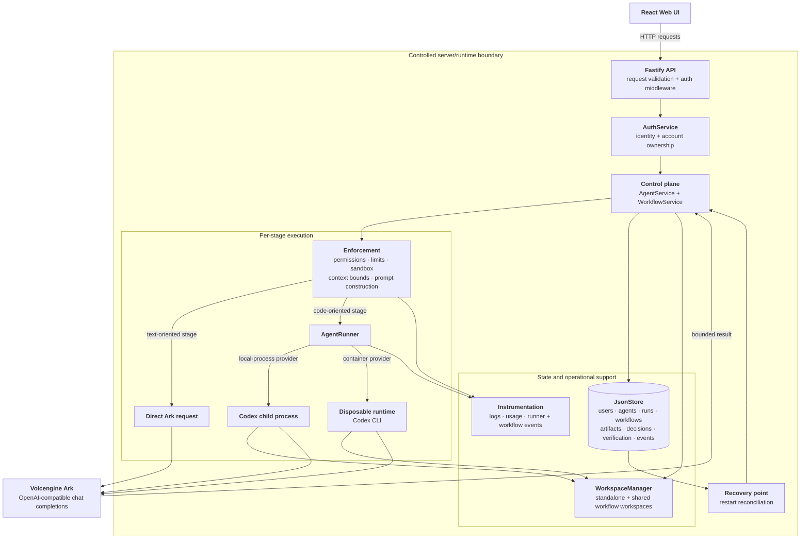

# Volc Agent Launchpad

Volc Agent Launchpad is a local-first web application for creating AI agents, giving them isolated workspaces, and coordinating them through human-approved multi-agent workflows. The server acts as the control-plane middleware between the browser, persistent state, Volcengine Ark, and the Codex CLI.

## Features

- Create, edit, start, stop, and archive standalone Agents.
- Give each standalone Agent its own workspace and resumable Codex conversation.
- Send prompts and inspect messages, run status, errors, and recorded usage.
- Create workflows for greenfield coding, existing-code changes, code review, research, blog writing, and custom planned pipelines. Multiple agents will be automatically created and assigned depending on the type of workflow.
    - e.g. greenfield coding pipeline of `Brainstormer → Developer → Tester → Reviewer`
    - e.g. existing-code pipeline of `Analyzer → Developer → Tester → Reviewer`
- Use human approval, revision, rejection, retry, repair, and continuation controls between workflow stages.
- Route text-focused stages through bounded direct Ark calls and workspace/tool stages through Codex, thereby ensuring cost-efficient token usage while maintaining quality responses.
- Allow the Tester to create tests, execute them, and make focused implementation fixes.
- Keep full artifacts for review while passing concise handoff summaries to later stages.
- Apply role-specific reasoning, timeout, output, retry, and verification controls to reduce token usage.
- Register accounts, sign in, change or recover passwords, and save theme/font preferences.
- Scope user-owned Agents and workflows by account; internal workflow workers are hidden from the standalone Agent list.
- Choose light, dark, sepia, forest, ocean, serif, modern, or accessibility-oriented presentation settings.
- Run Codex locally or in a disposable Docker/Podman runtime.

## Architecture and middleware rationale

The browser does not call Ark or Codex directly. The server is the middleware boundary that:

- authenticates users before account-owned resources are accessed;
- keeps API keys and Codex configuration off the browser;
- validates request bodies and workflow actions;
- assigns workspaces and permissions to each run;
- persists Agents, workflows, messages, artifacts, decisions, verification records, and recovery state;
- selects direct Ark or Codex execution for each stage;
- limits and summarizes context passed between stages; and
- converts runner failures or restarts into recoverable Agent/workflow states.



The trust boundary is the server/runtime boundary. User input, previous artifacts, verifier feedback, and files in a workspace are treated as potentially untrusted task data. The server controls which user can access a resource, which directory is mounted, and which sandbox mode a Codex run receives.

## Hybrid execution and cost controls

Direct Ark stages are used where a task can be completed from a bounded prompt and does not need tools. Developer and Tester stages use Codex because they need to inspect or modify the shared workspace. Coding Analyzers use read-only Codex inspection; greenfield workflows use Brainstormer instead of Analyzer.

Workflow verification is separate from individual Agent conversations. When enabled, the verifier makes an additional Ark request containing a bounded task/artifact summary and expects JSON with `pass`, `severity`, and `issues`. Coding workflows default to the `token_saver` profile, which skips this additional call and retains deterministic checks.

Handoffs keep complete stage output in the stored artifact for human review, but pass a shorter `handoffContent` to the next stage. Agents are instructed to leave source files and full test logs in the workspace and return summaries rather than reproducing them in their responses.

## Requirements

- Node.js 22 or newer.
- An Ark endpoint/model and API key for real Agent or workflow runs.
- Docker, Podman, or Colima for the disposable local runtime started by the POC script.
- Bash, such as Git Bash or WSL on Windows, to run `scripts/start-local-poc.sh`.

## One-command local setup

From the repository root, run the following in Git Bash, WSL, macOS, or Linux:

```bash
ARK_API_KEY=replace-with-your-key ARK_MODEL=ep-your-endpoint npm run poc
```

The script installs dependencies when needed, detects or starts a supported container engine, builds the Codex runtime image, creates persistent local state directories, builds the web/API application, and starts the server at <http://localhost:3000>.

On PowerShell, set the variables for the process and run the same script through Git Bash:

```powershell
$env:ARK_API_KEY="replace-with-your-key"; $env:ARK_MODEL="ep-your-endpoint"; npm run poc
```

The POC script stores local state under `.local` on Linux/Windows and under `~/.volc-agent-launchpad` on macOS. Set `LOCAL_POC_DATA_ROOT` when the container engine cannot access the default directory.

## Development commands

Install dependencies and run the web development server and API together:

```bash
npm install
npm run dev
```

The web development server runs on port 5173 and the API defaults to port 3000. Useful validation commands are:

```bash
npm run typecheck
npm test
npm run build
npm run check
```

`npm run check` performs typechecking, the automated test suite, and production builds.

## Accounts and configuration

The browser uses account credentials for protected API requests. New users register with a username, password, and security key. The security key supports password recovery; authenticated users can change their password and save presentation preferences.

Do not commit real credentials.

Important environment variables include:

| Variable | Purpose |
| --- | --- |
| `ARK_API_KEY` | Secret used by the server/Codex runtime to call Ark. |
| `ARK_MODEL` | Ark endpoint or model identifier. |
| `ARK_BASE_URL` | OpenAI-compatible Ark API base URL. |
| `APP_DATA_DIR` | Directory for application and credential JSON stores. |
| `AGENT_WORKSPACE_ROOT` | Root directory for Agent/workflow workspaces. |
| `CODEX_HOME` | Generated Codex configuration and session state. |
| `RUNTIME_PROVIDER` | `local-process` or `container`. |
| `CODEX_SANDBOX_MODE` | Default Codex sandbox: `read-only`, `workspace-write`, or `danger-full-access`. |
| `CODEX_TIMEOUT_MS` | Default maximum Codex run duration. |
| `CODEX_MAX_OUTPUT_BYTES` | Default captured Codex process-output ceiling. |
| `CONTAINER_ENGINE` | Docker or Podman executable for container execution. |

Use `.env.example` as a reference. It contains placeholders only and must not be filled with committed secrets.

## Demo steps

1. Start the application with `npm run poc` and open <http://localhost:3000>.
2. Register an account with a password and recovery security key.
3. Create a standalone Agent, review its instructions, and send a small prompt.
4. Open the workflow area and choose **Greenfield Coding** for a new project. Input a suitable task, such as "Come up with a poem and create a simple, suitably-themed website to showcase the poem". For demo purposes, select the lowest token usage setting.
5. Start the workflow and inspect the compact stage rail and conversation.
6. Approve a stage to continue, or use revision feedback to rerun it.
7. Approve the final stage, then use **Continue workflow** to begin another iteration with matching workers where available.
8. Open account settings to change the password or presentation preferences. 
9. Logout, then login with another account to check for no cross-account data leak. 
10. Logout, then login with the first account to check that preferences were saved.

## Automated tests

Run:

```bash
npm test
```

The Vitest suite currently contains 25 tests across six server test files. It does not call Ark or Codex. Fake runners and mocked HTTP responses test the control-plane behavior safely and deterministically, including:

- Agent lifecycle and run persistence.
- Authentication and protected API behavior.
- Database initialization and compatibility.
- Local and container Codex command construction.
- Sandbox and reasoning-effort propagation.
- Direct Ark output-limit handling.
- Greenfield and existing-code workflow stage selection.
- Tester attempt limits and token-saver verification behavior.
- Artifact preservation and concise handoff content.
- Workflow approval, revision, recovery, and continuation behavior.

Use `npm run check` before a handoff or demonstration to run tests together with typechecking and production builds.

## Limitations

- JSON files are suitable for a local proof of concept, not concurrent production-scale persistence.
- Ark and Codex usage depends on the selected model, reasoning effort, tool calls, workspace size, retries, and provider limits. Codex does not expose a dependable per-run `max_tokens` flag through the current CLI integration. Guardrails have been put in place, but they do not guarantee low token usage.
- Per-run Codex output ceilings limit captured process output; they are not a perfect API-token ceiling.
- Tester write access is directory-level. The prompt asks for focused test and bug-fix changes, but the sandbox cannot enforce a filename-level allowlist.
- Direct Ark roles do not have interactive workspace tools; they receive only the bounded task/artifact/workspace context supplied by the server.
- Coding Analyzer agents use read-only Codex inspection, while Developers and Testers share a workflow workspace. A container runtime provides stronger isolation than a local process, and the POC may fall back to the outer container boundary when the inner sandbox is unavailable.
- Password recovery relies on the user-provided security key and has no email or external identity-provider integration.
- The application does not provide multi-user collaboration inside one workflow; account isolation is enforced, but workflow ownership is not shared between accounts.
- Real provider tests are intentionally excluded from the default suite because they require credentials, network access, and consume Ark usage.

## Security notes

- Never commit `.env` files, API keys, passwords, security keys, Codex credentials, or persistent data directories.
- Keep unrelated host files and credentials outside Agent workspace mounts.
- Keep local use on loopback where possible and restrict ECS network access.
- Use a scoped, revocable Ark key and a unique `APP_AUTH_TOKEN`.
- Use `workspace-write` when Landlock is available; otherwise rely on the outer container boundary and treat the fallback as non-tenant-isolated.
