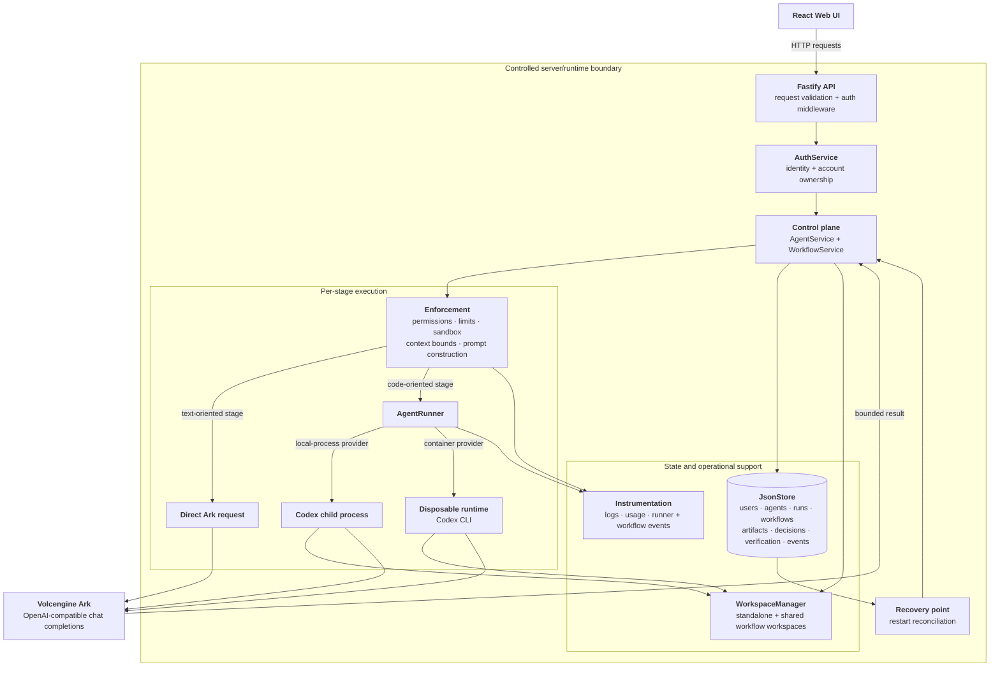

# Architecture

Volc Agent Launchpad is a single-node, local-first control plane. The browser
communicates only with the Fastify server; it never calls Ark or Codex directly.
The server owns authentication, persistence, workspace assignment, workflow
state, prompt construction, execution limits, and recovery.



## Components

### React web UI

The UI manages account registration, sign-in, password recovery, preferences,
standalone Agents, and human-controlled workflows. It polls the server for
asynchronous runs and workflow events. It sends username/password headers for
protected requests and does not receive Ark credentials or Codex configuration.

### Fastify control plane

`apps/server/src/app.ts` exposes the HTTP API, validates request bodies, and
authenticates protected routes through `AuthService`. Health, sign-in,
registration, password reset, and logout routes are public; Agent, system,
preference, and workflow resources require an authenticated account.

`APP_AUTH_TOKEN` remains a production configuration requirement for deployment
compatibility, but it is not the current browser/API authentication mechanism.
The application uses account credentials and scopes Agents and workflows by
the authenticated username.

### AgentService

`AgentService` handles standalone Agent lifecycle, message history, run
persistence, cancellation, and resumable Codex threads. A standalone Agent has
its own workspace and at most one active run. On restart, queued or running
runs become cancelled and busy Agents return to a usable state.

### WorkflowService

`WorkflowService` creates planned stages, assigns internal worker Agents,
tracks stage artifacts and events, and implements approval, revision, rejection,
retry, repair, pause, cancellation, and continuation. Workers used by a
workflow are hidden from the standalone Agent list.

The built-in coding templates are:

- **Greenfield Coding:** Brainstormer → Developer → Tester → Reviewer.
- **Existing Code Changes:** Analyzer → Developer → Tester → Reviewer.

The Analyzer is used for existing codebases. The Brainstormer is used for new
projects and can be reused when a workflow is continued. Developers and Testers
use Codex against the workflow workspace. The Tester can write and execute test
scripts and make focused implementation fixes. Later stages receive concise
handoff content while complete artifacts and logs remain available for review.

Other templates support blog posts, code review, research briefs, and custom
planned pipelines.

### Hybrid execution

Each workflow stage has an execution mode selected by the server:

- Text-oriented roles such as Brainstormer, Drafter, Editor, Researcher, and
  Reviewer use bounded direct Ark calls.
- Developer and Tester use Codex because they need workspace inspection or file
  changes. An Analyzer uses read-only Codex inspection for coding-related tasks;
  general analysis can use a bounded direct Ark call.
- Workflow verification is separate from individual Agent conversations. When
  enabled, it makes one additional bounded Ark request and expects structured
  JSON containing `pass`, `severity`, and `issues`. The `token_saver` profile
  skips that external verification while retaining deterministic checks.

Prompt construction adds the persona, selected skills, task, and prior artifact
context. Context budgets, concise handoffs, output-byte limits, timeouts,
reasoning effort, and stage attempt limits constrain cost. These are output and
execution controls; the Codex CLI integration does not provide a dependable
per-run API token ceiling.

### Storage and workspaces

The application stores JSON data under `APP_DATA_DIR`:

```text
launchpad.json          Agents, messages, runs, workflows, artifacts, events
credentials.json        Account password and recovery-key hashes
user-preferences.json   Per-account theme and font preferences
```

`JsonStore` serializes mutations and atomically replaces files. It supports
schema migration for the application database’s supported versions, but is
intended for one process and proof-of-concept use rather than concurrent
production-scale persistence.

`WorkspaceManager` keeps standalone Agent workspaces and shared workflow
workspaces under `AGENT_WORKSPACE_ROOT`. Archived Agent directories are moved
to the deleted-workspace area. Workspace paths are selected by the server and
passed to the runner; unrelated host files should never be placed inside a
mounted workspace.

### Runtime providers

`CodexRunner` starts the configured Codex executable with argv-only process
execution, JSON event output, a selected sandbox mode, timeout handling,
bounded captured output, cancellation, and optional thread resumption.

`ContainerCodexRunner` provides the local POC boundary by starting one
disposable Docker, Podman, or Colima-compatible runtime per turn. It mounts the
selected workspace and Codex home, applies CPU/memory/process limits, and
forwards only the required environment. The container runtime image includes
Node, Git, ripgrep, and a pinned Codex CLI.

The ECS deployment uses the `local-process` provider inside the application
container, so Codex runs in that container rather than in a second disposable
container. The local POC uses the container provider by default; local
development can use a host Codex process.

## Deployment profiles

| Profile | Control plane | Agent execution | Persistent paths |
| --- | --- | --- | --- |
| Local POC | Host Node.js | Disposable container per turn | Local `data`, `workspaces`, `codex-home` |
| Existing ECS | Application Docker container | Codex process in that container | Docker bind mounts under the app directory |
| Terraform ECS | Provisioned ECS + application container | Same as existing ECS | ECS host bind mounts |
| Local development | Host Node.js | Host Codex process | Configured local directories |

The application container listens on port 3000. Compose or Terraform maps the
configured public port, normally 80 for an ECS deployment. Terraform cloud-init
clones the selected public Git branch, writes the production environment file,
creates persistent directories, and invokes the existing-ECS deployment script.

## Trust and security boundaries

The primary POC trust boundary is the dedicated host/container environment, not
the individual Agent. Account ownership prevents cross-account API access, but
the application is not a hardened multi-tenant service. In particular,
`danger-full-access` removes Codex filesystem restrictions, and directory-level
workspace permissions cannot enforce filename-level policies.

Ark keys, account credentials, recovery keys, Codex credentials, environment
files, Terraform state, and persistent data must not be committed. Restrict
network ingress to the event or administrator network and add HTTPS before
sending passwords or recovery keys over an untrusted network.

## Extension seams

| Area | Primary seam | Purpose |
| --- | --- | --- |
| Execution | `AgentRunner` | Add another model/runtime provider or stronger isolation |
| Workflow | `WorkflowService` and `workflow-config.ts` | Add stages, templates, verifiers, and policies |
| Identity | `AuthService` and API hooks | Add external identity or collaboration permissions |
| Observability | Stored workflow events and runner events | Add live event streaming and richer diagnostics |
| Persistence | `JsonStore` boundary | Replace JSON files with a transactional database |
